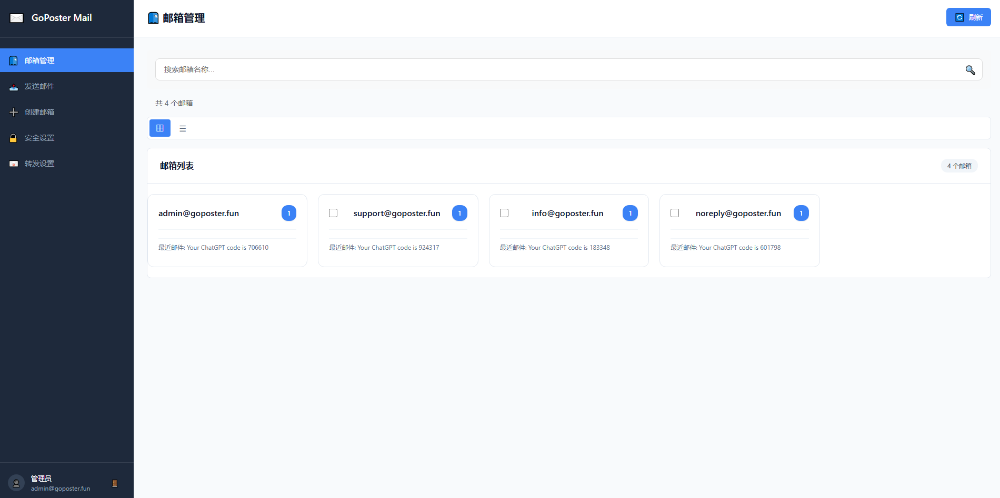

# 📧 Goposter Mail - 企业级开源邮件服务器

[](https://golang.org/)
[](https://reactjs.org/)
[](https://opensource.org/licenses/MIT)

**Goposter Mail** 是一个基于 Go 和 React 构建的现代化、高性能、安全的企业级邮件解决方案。它支持自定义域名部署，提供无限邮箱别名和支持用户隔离。



---

## ✨ 核心特性

<details>
<summary><strong>👑 企业级安全 (点击展开)</strong></summary>

- **双因素认证 (2FA):** 基于 TOTP 的时间码认证，兼容 Google Authenticator。
- **JWT 令牌系统:** 访问/刷新令牌机制，内置黑名单。
- **端到端加密:** 邮件内容使用 AES-256-GCM 加密存储。
- **密码安全策略:** 强制密码强度，防爆力破解（5次失败锁定30分钟）。
- **安全审计日志:** 追踪所有敏感操作，用于分析与回溯。
- **TLS/SSL 加密:** 全面支持 SMTP/IMAP/HTTPS 的 TLS 1.2/1.3 加密通信。
- **邮件认证:** 内置 SPF 和 DKIM 支持，防止邮件伪造。

</details>

<details>
<summary><strong>⚡ 高性能架构 (点击展开)</strong></summary>

- **异步邮件处理:** 基于内存队列，实现高吞吐量的邮件收发。
- **智能连接池:** 优化数据库和外部服务连接，减少延迟。
- **内存与资源监控:** 内置监控器，确保服务稳定运行。
- **Redis 缓存集成:** 加速热点数据访问，提升 API 响应速度。
- **原生 Go 并发:** 利用 Goroutine 实现极致的并发处理能力，轻松应对高负载。

</details>

<details>
<summary><strong>🎨 现代化前端 (点击展开)</strong></summary>

- **React 18 & Vite:** 最新的前端技术栈，提供极速开发体验。
- **响应式设计:** 完美适配桌面和移动设备，提供一致的用户体验。
- **虚拟列表:** 高效渲染上万封邮件列表，滚动如丝般顺滑。
- **PWA 离线支持:** 利用 Service Worker 实现核心功能的离线访问。
- **丰富交互:** 支持移动端手势（滑动删除、下拉刷新）、富文本编辑、实时搜索等。

</details>

## 🛠️ 技术栈

- **后端:** Go 1.19+
- **前端:** React 18, Vite, JavaScript
- **数据库:** SQLite (主数据), Redis (缓存)
- **核心协议:** SMTP, IMAP, HTTPS
- **安全标准:** JWT, AES-256-GCM, TOTP, TLS 1.3

## 🚀 快速上手

### 环境要求
- Go 1.19+
- Node.js 16+
- Redis (生产环境推荐)

### 快速部署

1.  **克隆项目**
    ```bash
    git clone https://github.com/xiaoju111a/Goposter.git
    cd Goposter
    ```

2.  **编译并启动后端服务器**
    ```bash
    cd backend
    go build -o mailserver .
    # 格式: ./mailserver [域名] [主机] [SMTP端口] [IMAP端口] [Web端口]
    sudo ./mailserver goposter.fun localhost 25 143 9090
    ```

3.  **启动前端服务器**
    ```bash
    cd ../frontend
    npm install
    npm run dev -- --port 8080 --host 0.0.0.0
    ```

4.  **访问界面**
    - **前端界面:** `http://localhost:8080`
    - **后端 API:** `http://localhost:9090`

### 默认登录账户
- **用户名:** `admin@goposter.fun`
- **密码:** `admin123`

## 🏭 生产环境部署

1.  **进入后端目录**
    ```bash
    cd backend
    ```

2.  **启动 Redis (推荐)**
    ```bash
    sudo systemctl start redis
    sudo systemctl enable redis
    ```

3.  **编译应用程序**
    ```bash
    # 此命令会在 backend 目录生成一个名为 mailserver 的可执行文件
    go build -o mailserver .
    ```

4.  **启动邮件服务器**
    > 需要 `sudo` 权限以监听低位端口 (25, 143)。

    ```bash
    # 启动 (前台运行)
    # 格式: ./mailserver [域名] [公网主机] [SMTP] [IMAP] [Web/API端口]
    sudo ./mailserver goposter.fun mail.goposter.fun 25 143 9090
    ```

5.  **后台持久化运行 (推荐)**
    ```bash
    nohup sudo ./mailserver goposter.fun localhost 25 143 9090 > server.log 2>&1 &
    ```

## 📁 项目结构

项目采用模块化的结构，后端和前端代码分离。

```
/
├── backend/          # Go 后端应用
│   ├── data/         # 运行时数据 (数据库, 邮件)
│   ├── go.mod        # Go 模块依赖
│   ├── main.go       # 主程序入口
│   ├── ...           # 其他核心 Go 源文件
│   └── mailserver    # 编译后的可执行文件
├── frontend/         # React 前端应用
│   ├── src/
│   └── ...
├── docs/             # 项目详细文档
└── benchmark/        # 性能测试脚本
```

## 🌐 DNS 配置

要使 `goposter.fun` 能够接收外部邮件，请确保以下 DNS 记录已正确配置：

| 类型  | 名称                       | 值 / 目标                  | 优先级 |
| :---- | :------------------------- | :------------------------- | :----- |
| **A** | `mail.goposter.fun`         | `[你的服务器IP]`           | -      |
| **MX**| `goposter.fun`              | `mail.goposter.fun`         | 10     |

## 🔌 端口配置

服务器需要开启以下端口以确保邮件服务正常运行：

### 必需端口
| 端口 | 协议 | 服务 | 说明 |
| :--- | :--- | :--- | :--- |
| **25** | TCP | SMTP | 邮件接收端口 (需要 sudo 权限) |
| **143** | TCP | IMAP | 邮件客户端访问端口 (需要 sudo 权限) |
| **9090** | TCP | 后端API | 邮件服务器后端管理接口 |
| **8080** | TCP | 前端Web | 前端管理界面访问端口 |

### 防火墙配置示例
```bash
# Ubuntu/Debian
sudo ufw allow 25/tcp
sudo ufw allow 143/tcp
sudo ufw allow 9090/tcp
sudo ufw allow 8080/tcp

# CentOS/RHEL
sudo firewall-cmd --permanent --add-port=25/tcp
sudo firewall-cmd --permanent --add-port=143/tcp
sudo firewall-cmd --permanent --add-port=9090/tcp
sudo firewall-cmd --permanent --add-port=8080/tcp
sudo firewall-cmd --reload
```

## 📧 SMTP中继配置

goposter 支持通过 SMTP 中继发送邮件，提供更稳定的邮件投递服务。已内置支持以下中继服务商：

### 支持的中继服务商
- **🐧 腾讯云邮件推送 (SES)** - 稳定的企业级邮件服务
- **🌟 Amazon SES** - 高可靠性的云邮件服务
- **🔧 自定义 SMTP** - 支持任意 SMTP 服务器

### 配置方法
1. 编辑 `backend/data/smtp_relay.json` 文件
2. 填入您的 SMTP 服务器信息：
   ```json
   {
     "enabled": true,
     "host": "smtp.example.com",
     "port": 587,
     "username": "your_username",
     "password": "your_password",
     "use_tls": true
   }
   ```
3. 重启邮件服务器即可生效

### 配置指南
- **[腾讯云邮件推送配置](./docs/guides/TENCENT_SES_GUIDE.md)**
- **[Amazon SES配置](./docs/guides/AMAZON_SES_GUIDE.md)**

> 💡 **提示：** 使用SMTP中继可以显著提高邮件送达率，避免被标记为垃圾邮件。

## 📈 性能亮点

本项目经过了严格的高并发性能测试，结果表明其完全具备企业级生产部署能力。

| 测试项目 | 并发数 | 峰值吞吐量 | 平均G响应时间 | 成功率 |
|:---|:---:|:---:|:---:|:---:|
| **API 接口 (Node.js)** | 100 | **1,234 req/s** | 35.5ms | 100% |
| **SMTP 连接 (Go)** | 50 | **1,372 conn/s** | 1.5ms | 100% |
| **邮件发送 (Node.js)** | 50 | **153 emails/s** | 26.8ms | 100% |
| **突发连接 (Python)** | 150 | **瞬时处理** | 0.08s | 100% |

> 🏆 **结论:** 邮箱服务器性能**远超预期目标**，在响应速度、并发处理和稳定性方面均达到或超过了企业级标准。

## 📋 TODO

- [ ] 完善邮件解析功能
- [ ] 多域名部署支持
- [ ] 垃圾邮件过滤
- [ ] 邮件备份功能

## 🤝 贡献

欢迎各种形式的贡献，包括但不限于：
- 提交 Bug 报告
- 提出功能建议
- 完善文档
- 提交 Pull Request

## 📄 许可证

本项目基于 [MIT License](./LICENSE) 开源。
